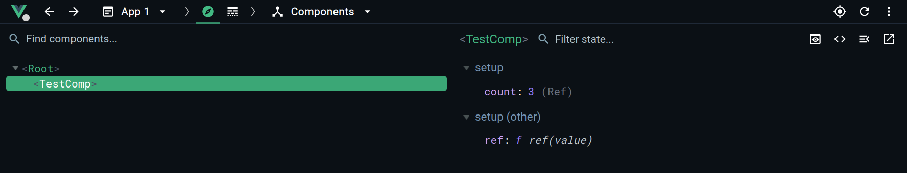

# Issue

## How to reproduce

```bash
pnpm i
pnpm build
pnpm inspect-build
```

## Expected output

```
Component name: TestComp
```

## Actual output

```
Component name: undefined
```

## Details

The issue is that compiled SFCs don't contain component names. It is the issue for a component library, because when you try to use this library you see a lot of "Anonymous" in DevTools and Vue warnings.

[The documentation](https://vuejs.org/api/options-misc.html#name) says:

> When you use Single-File Components, the component already infers its own name from the filename. For example, a file named `MyComponent.vue` will have the inferred display name "MyComponent".

But in the actual build we can see this:

```js
import { ref, openBlock, createElementBlock, toDisplayString } from "vue";
const _sfc_main = {
  setup(__props) {
    const count = ref(0);
    return (_ctx, _cache) => {
      return openBlock(), createElementBlock("button", {
        onClick: _cache[0] || (_cache[0] = ($event) => count.value++)
      }, "Inc " + toDisplayString(count.value), 1);
    };
  }
};
export { _sfc_main as TestComp };
```

No any traces of the component name.

Anyway, everything is fine in vite's dev mode (run `pnpm dev` and see devtools):


